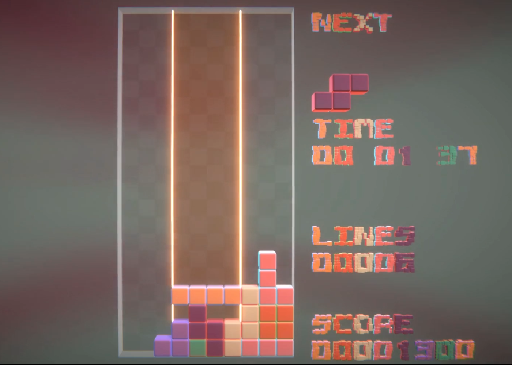

+++
title = 'Genesis'
date = 2024-09-03T23:08:26+02:00
draft = true
+++

<!--
shortcode to define image size

-->

# How it started
The initial goal when I started working on this game was to stress test Unity's `VFX Graph Custom HLSL` new feature.
I needed a simple game idea that can be implemented in about a week.
I choose to implement a Tetris clone because it looked quite simple, and it's a game I love.
I played it so many hours!  

Well, even though we got quite a nice result in that short period of time (with the help of my friend Orson), I must admit it was probably not the best choice.
Actually it's not as easy as it seems, especially when you want to implement it in "pure HLSL".
Of course the whole game do not fit in HLSL code, there's some GameObject and other systems involved (Input System, NetCode...).

Time for a screenshot, the first tetrominos on screen, using `VFX Graph` and `Custom HLSL`

The main idea, is to read and write tetromino's position in a graphic buffer in VFX Graph.
Debugging HLSL is not as easy as debugging C#, so I had to create some visualization tools to help a bit.

The play field is a single `VFX Graph` system and each tetromino is a particle.
Each particle is made of four cube meshes (the system has four outputs, see screenshot below).
That bring me to one of the most difficult part: a tetromino is made of 4 parts, but at some point the tetromino can break.
So, the 4 parts must stick together while the tetromino is falling, but then, when a line is killed, they can fall or be erased independently.  

Here is a piece of HLSL code that is used to handle tetromino movement taking collision into account:

void MoveIfNoCollision(inout VFXAttributes attributes, in RWStructuredBuffer<uint> buffer, in float3 move, in uint width)
{
    if (length(move) > 0)
    {
        float3 newPos = attributes.position + move;
        // If any point is colliding the block can't move
        if (IsPointColliding(buffer, attributes.Point1 + newPos, width)) return;
        if (IsPointColliding(buffer, attributes.Point2 + newPos, width)) return;
        if (IsPointColliding(buffer, attributes.Point3 + newPos, width)) return;
        if (IsPointColliding(buffer, attributes.Point4 + newPos, width)) return;
        {
            attributes.position = newPos;
        }
    }
}


In the code above, the `Point1`, `Point2`, `Point3` and `Point4` attributes are each part position relative to the particle pivot point.
And the `IsPointColliding` function check the point position against the field edges, but also agains other tetrominos (thanks to the buffer).

Here is the result we got after this week of work

The game loop was done, you could play a game until you loose (with some bugs, see below) and play again.

# How it's going
This project should have stopped there, but I enjoyed so much working on it, that I decided to make a real game out of it.
Here is the plan in order of priority:
1. Bug free game play (that should go without saying...)
2. Game menu
3. Sound FX
4. Improve graphics
5. Leader board
6. Multiplayer (local)
7. Multiplayer (network with lobby)
8. Campaign mode

