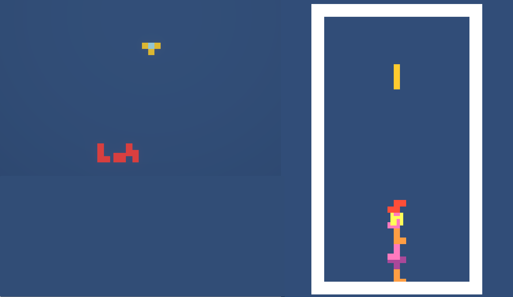

+++
title = 'Genesis'
date = 2024-09-06T23:08:26+02:00
draft = false
+++

<!--
shortcode to define image size

-->

# How it started
The initial goal when I started working on this game was to stress test Unity's `VFX Graph Custom HLSL` new feature.
I needed a simple game idea that can be implemented in about a week.
I choose to implement a Tetris clone because it looked quite simple, and it's a game I love.
I played it so many hours!  

Well, even though we got quite a nice result in that short period of time (with the help of my friend Orson), I must admit it was probably not the best choice.
Actually it's not as easy as it seems, especially when you want to implement it in "pure HLSL".
And by the way, don't do this at home...custom HLSL is not meant for game logic! 
Of course the whole game do not fit in HLSL code, there's some GameObject and other systems involved (Shader Graph, Input System, Sound, NetCode...).

Time for a screenshot, the first tetrominos on screen, using `VFX Graph` and `Custom HLSL`.

---

Debugging HLSL is not as easy as debugging C#, so I had to create some visualization tools to help a bit.

On the left it's a simple representation of the graphic buffer, and on the right, the game play field (both are VFX Graph systems actually).

---

The play field is a single VFX Graph system and each tetromino is a particle.
Each particle is made of four cube meshes (the system has four outputs, see screenshot below).

The particle system has 4 `Custom Attributes` defined to handle each part's relative position (see hlsl code below).
When a particle's position move, all 4 parts move together (when the user controls the tetromino).
When a line is killed, each part on that line is virtually killed (the owner particle might be still alive if some parts are still visible).
Also, when a line is killed, some parts can fall down, in that case, it's the part's relative position which is updated, not the owner particle's position.



---

The main idea, is to read and write tetromino's position in a graphic buffer in VFX Graph.
This buffer is needed because each particle need to know the state of the whole play field to properly handle `collisions` and `line kill`.

Tetromino `move`, `rotation`, `falling` and `scoring` are also managed in the VFX Graph system. Even the [wall kick](https://tetris.wiki/Wall_kick) is supported.
The scoring is based on the information grabbed [here](https://tetris.wiki/Scoring) and the falling speed algorithm based on data provided [here](https://harddrop.com/wiki/Tetris_Worlds)

---

Here is a piece of HLSL code that is used to handle tetromino movement taking collision width edges and other tetrominos into account:

uint PositionToIndex(float3 pos, int width)
{
    return round(pos.x) + width * round(pos.y);
}

bool IsPointColliding(in RWStructuredBuffer<uint> buffer, in float3 newPos, uint width)
{
    if (newPos.y < -0.5)
        return true;

    if (newPos.x < -0.5)
        return true;

    if (newPos.x >= width)
        return true;
    
    uint index = PositionToIndex(newPos, width);
    uint value = buffer[index];
    return value > 0 && value < 8;
}

void MoveIfNoCollision(inout VFXAttributes attributes, in RWStructuredBuffer<uint> buffer, in float3 move, in uint width)
{
    if (length(move) > 0)
    {
        float3 newPos = attributes.position + move;
        // If any point is colliding the block can't move
        if (IsPointColliding(buffer, attributes.Point1 + newPos, width)) return;
        if (IsPointColliding(buffer, attributes.Point2 + newPos, width)) return;
        if (IsPointColliding(buffer, attributes.Point3 + newPos, width)) return;
        if (IsPointColliding(buffer, attributes.Point4 + newPos, width)) return;
        {
            attributes.position = newPos;
        }
    }
}


In the code above, the `Point1`, `Point2`, `Point3` and `Point4` attributes are each part's position, relative to the particle pivot point.
And the `IsPointColliding` function check the point position against the field edges, but also against other tetrominos (thanks to the buffer).
The buffer stores an uint value, 0 meaning the celle is empty, 1 to 7 is the id of the tetromino kind and above 8 is other special states.

---

Here is the result we got after this week of work

The game chore mechanic works, only one UI screen has been implemented to let the player again.

# How it's going
This project should have stopped there, but I enjoyed so much working on it, that I decided to make a real game out of it.
Here is the plan in order of priority:
1. Bug free game play (that should go without saying...)
2. Game menu
3. Sound FX
4. Improve graphics
5. Leader board
6. Multiplayer (local)
7. Multiplayer (network with lobby)
8. Campaign mode

